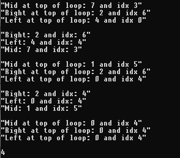

# Curated List Day 8: Search in Rotated Array

Hello again and welcome back to our journey through the curated list you can 
find at this post here at [TeamBlind.com](https://www.teamblind.com/post/New-Year-Gift---Curated-List-of-Top-75-LeetCode-Questions-to-Save-Your-Time-OaM1orEU). 
Today we are going to keep working on the array portion of the list, with 
Search in Rotated Sorted Array. Let’s take a look at our question: 

> There is an integer array nums sorted in ascending order (with distinct values).

> Prior to being passed to your function, nums is possibly rotated at an 
> unknown pivot index k (1 <= k < nums.length) such that the resulting array 
> is [nums[k], nums[k+1], ..., nums[n-1], nums[0], nums[1], ..., nums[k-1]] 
> (0-indexed). For example, [0,1,2,4,5,6,7] might be rotated at pivot index 3 
> and become [4,5,6,7,0,1,2].

> Given the array nums after the possible rotation and an integer target, 
> return the index of target if it is in nums, or -1 if it is not in nums.

> You must write an algorithm with O(log n) runtime complexity.”

Similar to our [Maximum Subarray](https://github.com/Kmullen444/article_problems/tree/main/max_pro_subarray) 
and [Maximum Product Subarray](https://github.com/Kmullen444/article_problems/tree/main/max_pro_subarray), we are going to 
be on our code from our Find Minimum In Rotated Sorted Array that can be found 
[here](https://github.com/Kmullen444/article_problems/tree/main/min_rotated). Like 
in the Find Minimum problem, we know that we are going to be using a binary search.

So with that let’s start breaking down the code. As with our last one we are 
going to need a few variables, one for the left index and one for our right 
index. We are also going to need to throw a -1 at the bottom of our function 
that will return if we don’t find the target number.

```
def search(nums, target)
  left_idx = 0
  right_idx = nums.length - 1

  while left_idx <= right_idx do 
    mid_idx = right_idx + (left_idx - right_idx) / 2

    right_num = nums[right_idx]
    left_num  = nums[left_idx]
    mid_num   = nums[mid_idx]

    return if mid_idx == target

    if mid_num >= left_num
      target > mid_num || target < left_num ? left_idx = mid_idx + 1 : 
        right_idx = mid_idx - 1
    else
      target < mid_num || target > right_num ? right_idx = mid_num - 1 :
        left_idx = mid_idx + 1;
    end
  end
  -1
end
```
```
function search(nums, target) {
  let left_idx  = 0;
  let right_idx = nums.length - 1;

  while (left_idx <= right_idx){
    let mid_idx = right_idx + (left_idx - right_idx) / 2;

    if (nums[mid_idx] === target) return mid_idx;

    if (nums[mid_idx] >= nums[left_idx]){
      if (target > nums[mid_idx] || target < nums[left_idx]){
        left_idx = mid_idx + 1;
      } else {
        right_idx = mid_idx - 1;
      }
    } else {
      if (target < nums[mid_idx] || target > nums[left_idx]){
        right_idx = mid_idx - 1;
      } else {
        left_idx = mid_idx + 1;
      }
    }
  }
  return -1;
}
```


Now we can set up our while loop that will continue until our left_idx is 
smaller or equal to our right_idx. Within our loop we are going to need an 
implicit return that will give us our mid_idx and break us out of our loop if 
we find that our mid_num is equal to our given target number. 

Now that’s talk about our conditionals. For ease of reading this section let’s 
break it up into chunks. Our first chunk is going to be dealing with our array 
from the midpoint to the left most end. We need to check that our mid number is 
greater or equal to our left number. If it is then we also need to see if our 
target number is greater than our mid_num or whether our target is less than 
left_num. If it is then we can change our left_idx to our mid_idx + 1 and if not 
then we change our right_idx to equal mid_idx - 1.

On to the next chuck! This time dealing with the midpoint of our array to the 
right most end that lives in our else statement. In this chunk we will be 
checking if our target is less than our mid number or the target is greater 
than our right number. If it is, we move our right_idx to our mid_idx - 1 
and if not we move our left_idx to our mid_idx + 1.

To get a better sense of what is happening, throw some print statements in our 
loop and see how it changes. We can see our numbers at the top of our loop and 
after we’ve run through our conditionals. 

```
def search(nums, target)
  left_idx = 0
  right_idx = nums.length - 1

  while left_idx <= right_idx do 
    mid_idx = right_idx + (left_idx - right_idx) / 2

    right_num = nums[right_idx]
    left_num  = nums[left_idx]
    mid_num   = nums[mid_idx]
    
    p "Mid at the top of the loop: #{mid_num} and idx #{mid_idx}"
    p "Right at the top of the loop: #{right_num} and idx #{right_idx}"
    p "Left at the top of the loop: #{left_num} and idx #{left_num}"

    return if mid_idx == target

    if mid_num >= left_num
      target > mid_num || target < left_num ? left_idx = mid_idx + 1 : 
        right_idx = mid_idx - 1
    else
      target < mid_num || target > right_num ? right_idx = mid_num - 1 :
        left_idx = mid_idx + 1;
    end
    p "Right: #{right_num} and idx #{right_idx}"
    p "Left: #{left_num} and idx #{left_idx}"
    p "Mid: #{mid_num} and idx #{mid_idx}"
  end
  -1
end
```



We continue our loop until we break out with our return at the top of our loop 
or return a -1 if we don’ t find our target.

And that’s it, another day down. As we work through this just a friendly 
reminder that if you find that you are stuck on a problem and can’t seem to 
figure it out, LOOK IT UP! Once you find an answer that might start to make 
sense, throw it in a text editor, add some print statements and pick it apart 
until you understand it fully. 

Thanks for reading, if you have a different way of doing the problem please 
post it below. See you guys next time!

